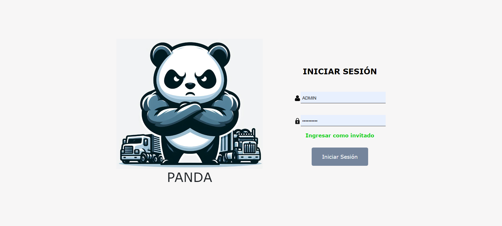

# Backend Project Documentation for Transport Company

## Project Description
This backend project developed in Spring Boot is designed to manage records of workers, drivers, trucks, carts and users for a transportation company. It offers a set of functionalities that include security, data transaction, connection to external services of Reniec and Sunat, documentation with Swagger, exception control, access to PostgreSQL database hosted on AWS RDS, unit testing, and generation of reports in PDF format. The application is deployed on AWS EC2 instances for scalability and reliability.

## Key Features
- Security: Implemented using Spring Security and JWT (JSON Web Tokens), with access control for different types of users.
- Data Transaction: Utilizes Spring Data with Hibernate for efficient database management.
- Connection to External APIs: Integration with Reniec and Sunat services to obtain additional information about users and drivers.
- Documentation: Automatically generated with Swagger for a clear and easy-to-understand API.
- Exception Control: Error and exception handling to ensure system stability.
- Database: Utilizes PostgreSQL as a relational database to securely and efficiently store system data.
- Unit Testing: Includes unit tests implemented with JUnit and Mockito to ensure code quality.
- Report Generation: Allows the creation of PDF reports using JasperReports-Fonts.
- Invoice Generation: Ability to generate invoices for transportation services rendered, providing a detailed record of services provided and associated costs.
- Carrier Guide Generation: Allows the creation of carrier guides to document the movement of goods during transportation, including information about the load, origin, and destination.
## Technologies Used
- Spring Boot: Java application development framework.
- Spring Security: Provides authentication and authorization for Spring applications.
- JWT (JSON Web Tokens): Used for secure user authentication.
- Spring Data: Facilitates data access and manipulation using the Spring-based programming model.
- Hibernate: Object-relational mapping framework for Java.
- Swagger: Tool for automatic API documentation generation.
- PostgreSQL: Relational database management system.
- JUnit and Mockito: Unit testing frameworks for Java.
- JasperReports-Fonts: Library for generating PDF reports.
- OpenFeign: For consuming external APIs.
- AWS RDS (Relational Database Service): Utilized for hosting the PostgreSQL database securely and efficiently.
- AWS EC2 (Elastic Compute Cloud): Deployed the application on EC2 instances for scalability and reliability.
- 

  

## Installation and Usage Requirements
To run this project in your local environment, make sure you have the following installed:

- Java JDK (preferably version 8 or higher)
- Maven
- PostgreSQL (with a created database)
- Git (optional)
## Installation and Usage Requirements

1. Clone the repository from GitHub or download the source code.
2. Configure the PostgreSQL database according to the specifications in the configuration file.
3. Compile the project using Maven: mvn clean install.
4. Run the Spring Boot application: java -jar filename.jar.
5. The application will be available at http://localhost:port.
## Contribution
If you wish to contribute to this project, please open an issue or send a pull request on GitHub.

## Contact
For more information, please contact Jefferson Panta at Pantajefferson173@gmail.com.
